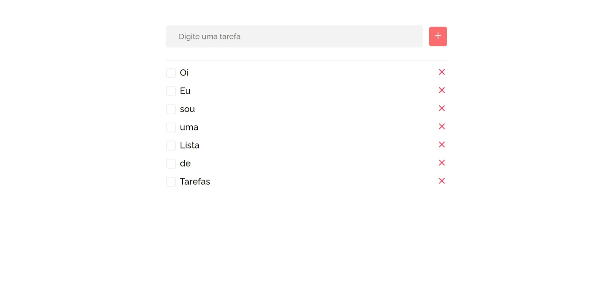

<h1 align="center"> Lista de Tarefas </h1>

Repositório para o desafio que o mentor João Louzada do programa desenvolve do grupo boticário passou como treinamento para React

  <a href="#-tecnologias">Tecnologias</a>&nbsp;&nbsp;&nbsp;|&nbsp;&nbsp;&nbsp;
  <a href="#-projeto">Projeto</a>

 

  

 

## 🚀 Tecnologias

Esse projeto foi desenvolvido com as seguintes tecnologias:

- HTML e CSS
- JavaScript
- LocalStorage
- React
- React Hooks (useState, useEffect)
- LocalStorage

 

## 💻 Projeto

O projeto tem como objetivo a criação de uma lista de tarefas
Foi utilizado o LocalStorage para armazenar as tarefas do usuário.
Você pode ver o projeto [clicando aqui](https://todo-list-mu-six.vercel.app/).
 
